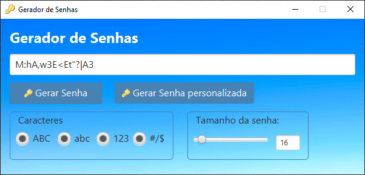

# Gerador de Senhas

## Descrição
Com o aumento da necessidade de segurança digital, criar senhas fortes está cada vez mais desafiador. Letras, números, caracteres especiais, e um comprimento superior a 6 caracteres tornam o processo ainda mais complicado para muitos usuários.  
Este projeto tem como objetivo oferecer uma solução simples e prática para gerar senhas seguras de forma automática. Não se trata de um projeto com foco visual, mas sim em funcionalidade e eficiência.

## Recomendação de Uso
- **Use senhas com 8 ou mais caracteres** para aumentar a segurança.
- Evite utilizar apenas letras ou números, a menos que seja estritamente necessário.
- Sempre utilize combinações de letras maiúsculas, minúsculas, números e caracteres especiais para criar senhas mais fortes.

## Como Executar o Projeto

1. **Crie um novo projeto Java**: Utilize a IDE de sua preferência.
2. **Substitua a pasta `src`**: No diretório do seu projeto, substitua a pasta `src` pela pasta `src` fornecida neste repositório.
3. **Compile e execute o código**: A partir de sua IDE, compile o projeto e execute para começar a gerar senhas automaticamente.

### Tecnologias Utilizadas
- **Linguagem**: Java
- **Bibliotecas**: Bibliotecas padrão do Java utilizadas para gerar senhas aleatórias.

Sinta-se à vontade para contribuir ou abrir issues com sugestões de melhoria!
